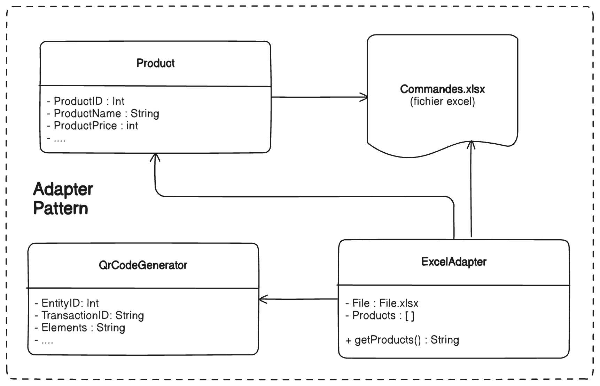
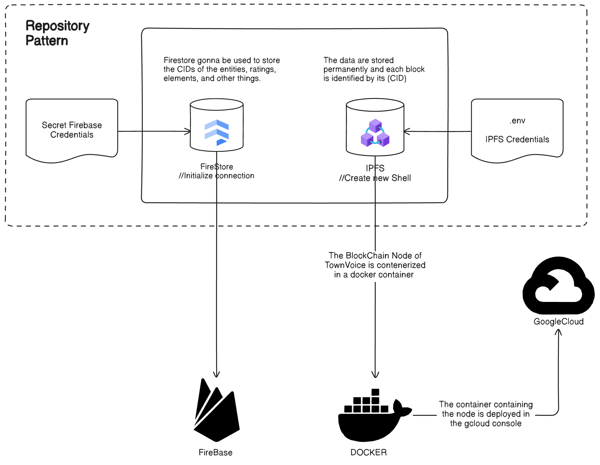
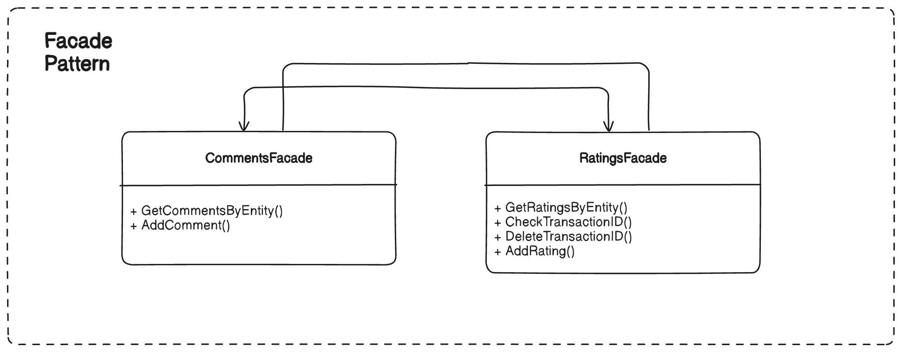
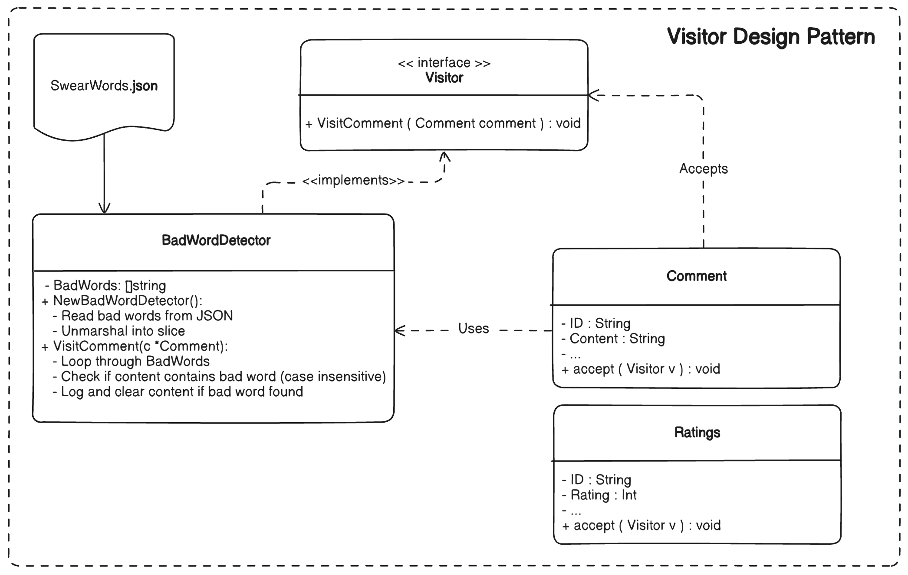
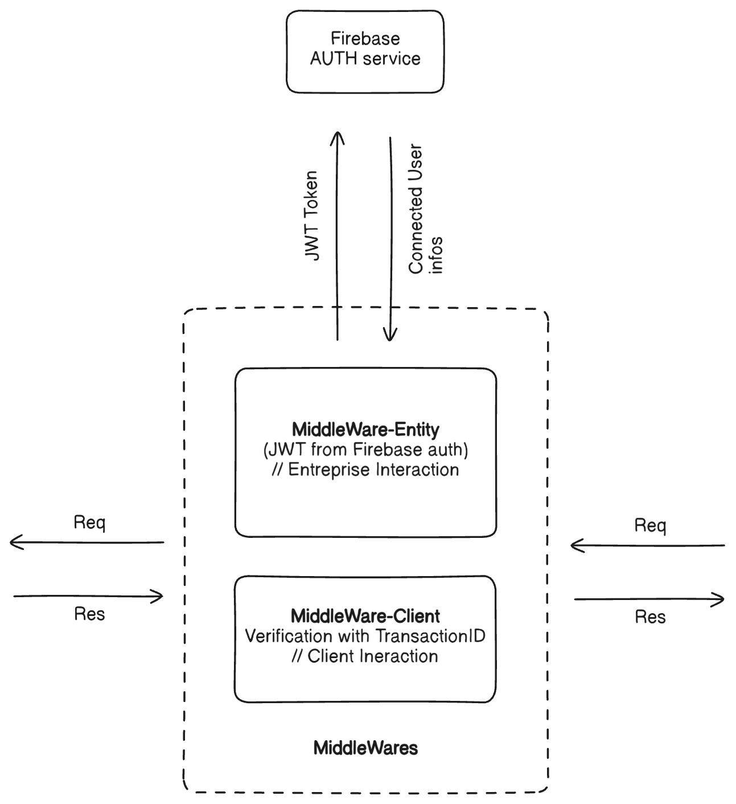
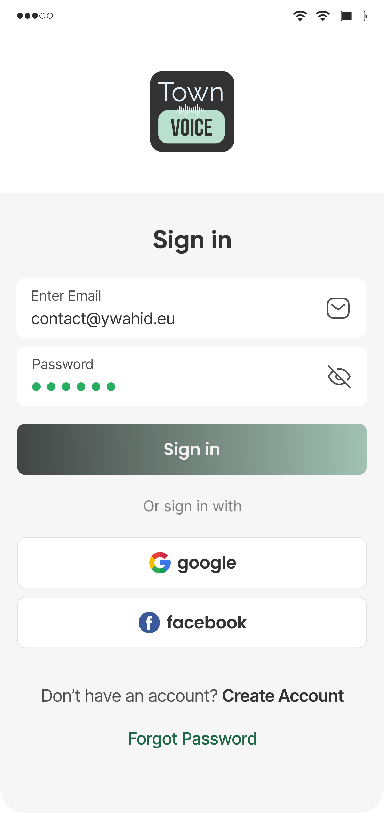
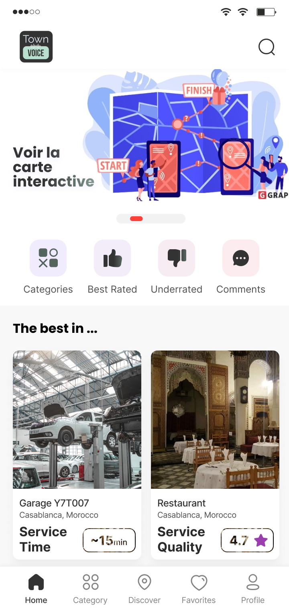

# **TownVoice**Blockchain-Based Rating System ✨

Welcome to the **TOWN VOICE** project! 🚀 This system ensures transparency and reliability for rating and commenting on public and private services like restaurants, organizations, and more. By leveraging **blockchain technology** for storing data and **Firebase** for auxiliary functionalities, this project offers a robust and trustworthy solution. 

### Project Author
Developed with dedication by **Yassir WAHID (Y7TT007)**. 🌐 Visit my [website](https://ywahid.eu) for more details on my work.

## Table of Contents
- [Project Overview](#project-overview)
- [Architecture](#architecture)
  - [Overview](#overview)
  - [Component Breakdown](#component-breakdown)
- [Repositories](#repositories)
- [Getting Started](#getting-started)
- [Screenshots](#screenshots)
- [Acknowledgments](#acknowledgments)

## Project Overview
This application is designed to:
- **Rate and comment** on services using QR codes.
- Ensure **transparency** by storing all ratings and comments on a blockchain database.
- Provide **administrative tools** to analyze data and view trends.

The system comprises three main components:
1. **Backend**: Powered by Go and blockchain.
2. **Public Client**: A React-based app for users to scan QR codes and submit ratings/comments.
3. **Admin Client**: A React-based app for administrators to view analytics and manage the system.

## Architecture
### Overview
Below is a high-level architecture of the system:


### Component Breakdown
1. **Adapter Pattern for QR Codes**:
   - Converts QR code data into compatible formats for the system.
   - Ensures seamless interaction with the blockchain.
   
   

2. **Repository Pattern for Blockchain Database**:
   - Manages interactions with the IPFS-based blockchain.
   - Provides abstraction for data storage and retrieval.

   

3. **Facade Pattern for Inter-Repos Communication**:
   - Connects the backend with public and admin clients.
   - Simplifies complex operations into user-friendly APIs.

   

4. **Visitor Pattern for Comment Moderation**:
   - Detects inappropriate or offensive words before storing comments on the blockchain.
   - Ensures data integrity and compliance.

   

5. **Middleware Pattern for Authentication**:
   - Implements secure user authentication and authorization.
   - Protects sensitive routes and ensures data security.

   

## Repositories
1. **[Backend Repository](https://github.com/Y7T007/TownVoice)** (current repo):
   - Built with Go and blockchain technologies.

2. **[Public Client Repository](https://github.com/Y7T007/TownVoiceFrontEnd)**:
   - React-based app for users to rate and comment.

3. **[Admin Client Repository](https://github.com/Y7T007/TownVoice-Dashboard-Entreprise)**:
   - React-based app for administrators to view and analyze data.

## Getting Started
### Prerequisites
- Go (1.18 or later)
- Firebase credentials
- Node.js (for client apps)

### Backend Setup
1. Clone the repository:
   ```bash
   git clone https://github.com/Y7T007/blockchain-rating-backend.git
   cd blockchain-rating-backend
   ```
2. Install dependencies:
   ```bash
   go mod tidy
   ```
3. Run the server:
   ```bash
   go run main.go
   ```

### Public and Admin Clients
Refer to their respective repositories for setup instructions.

## Screenshots
### Public Client

<div style="display: flex; justify-content: space-between;">
  
  
</div>

## Acknowledgments
Special thanks to my collaborators:
- **Nossair SEDKi**
- **Mohammed Amine EL METNI**

Your support and contributions were invaluable in bringing this project to life! 🙌
